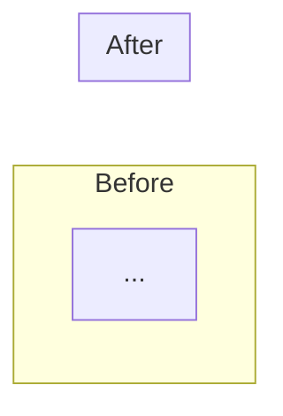
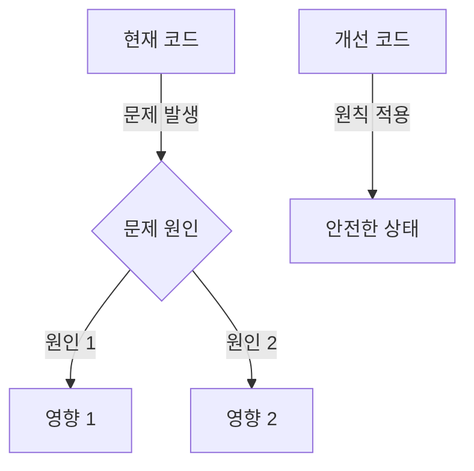

# Markdown 출력 템플릿

yoda의 마크다운 출력 형식을 정의하는 템플릿. Review 모드와 Share 모드(md 포맷) 두 가지 출력 구조를 포함한다.

---

## Review 모드 출력 템플릿

3계층 점진적 공개(Progressive Disclosure) 구조. 독자의 시간 예산에 따라 Layer 1만 읽거나, Layer 3까지 깊이 읽을 수 있다.

### 전체 구조

````markdown
# 코드 리뷰: `{대상 타입/파일명}`

## Layer 1: 핵심 요약

{대상}은(는) {핵심 문제를 한 문장으로 요약}.

🔴 {n} | 🟡 {n} | 🔵 {n} | 🟢 {n} | 💡 {n}

| # | 심각도 | 위치 | 제목 | 한줄요약 |
|---|--------|------|------|----------|
| 1 | 🔴 | `{파일명}:{라인}` | {제목} | {한 문장 설명} |
| 2 | 🟡 | `{파일명}:{라인}` | {제목} | {한 문장 설명} |
| 3 | 🔵 | `{파일명}:{라인}` | {제목} | {한 문장 설명} |
| 4 | 🟢 | `{파일명}:{라인}` | {제목} | {한 문장 설명} |
| 5 | 💡 | — | {제목} | {한 문장 설명} |

---

## Layer 2: 상세 분석

### 🔴 Must Fix: {발견 제목}

💭 {호기심 트리거 — 구체적 사실 기반의 정보 격차 질문}

**Before**

```{language}
// 실제 문제 코드를 그대로 인용
// ⚠️ 마커로 문제 지점 표시
```

💡 **Why**: {원칙 명명 + 실제 영향}

{위반된 설계 원칙/패턴을 명명한다.}
{이 문제가 프로덕션에서 어떤 결과를 초래하는지 구체적으로 기술한다.}

**After**

```{language}
// 수정 코드 + 핵심 변경에 ✅ 인라인 주석
```

---

### 🟡 Should Improve: {발견 제목}

💭 {호기심 트리거}

**Before** / 💡 **Why** / **After** (동일 구조)

---

### 🔵 Nits

| 위치 | Before | After | Why |
|------|--------|-------|-----|
| L{n} | `{문제 코드}` | `{수정 코드}` | {한 줄 이유} |

---

## Layer 3: 깊은 통찰

### 🟢 Praise: {칭찬 제목}

```{language}
// 잘 작성된 코드 인용
```

{왜 좋은지 설명. 적용된 원칙 명명.}

---

### 💡 Insight: {통찰 제목}

{이 코드를 넘어 팀/프로젝트 수준의 통찰.}
{구체적 실행 방안 포함.}

---

### 아키텍처 시각화

> 아키텍처 변경이 필요한 🔴 또는 🟡 발견이 있을 때만 포함한다.



---

### 생각해볼 점

1. {확장성/변경 대응 질문}
2. {전이/적용 질문}

---

> 이 리뷰를 팀과 공유하려면: `/yoda share --from-review`
````

---

## Share 모드 (md 포맷) 출력 템플릿

교육/공유 목적의 마크다운 문서.

### 전체 구조

````markdown
# {주제 제목}

> **TL;DR**: {핵심 메시지를 한 문장으로.}

---

## 왜 이것이 중요한가

💭 {호기심 트리거}

{이 주제가 왜 중요한지 2-3문장으로 설명.}

---

## 멘탈 모델



{다이어그램 보충 설명.}

---

## 실전 예제

### Before: 문제 상황

```{language}
// 실제 코드 또는 코드베이스에서 발견한 패턴
```

### 분석: 무엇이 문제인가

💡 **{원칙명}**: {원칙 설명과 코드에서의 위반 지점}

1. **{문제 1}**: {설명}
2. **{문제 2}**: {설명}

### After: 개선된 코드

```{language}
// 단계별 개선 과정을 설명하며 제시
// ✅ 인라인 주석
```

---

## 핵심 원칙

| 원칙 | 설명 | 적용 지점 |
|------|------|----------|
| {원칙 1} | {한 줄 설명} | {코드에서 어디에 적용했는지} |

---

## 생각해볼 점

1. {정교화 질문}
2. {확장 질문}
3. {전이 질문}

---

## 더 알아보기

- [{관련 공식 문서}]({URL})
- [{관련 기술 블로그/논문}]({URL})
````
